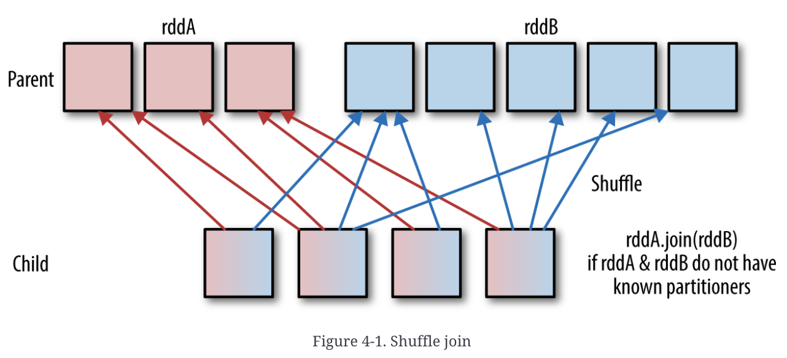

---

# 0. Resources

- “Spark Optimization with Scala” course by Daniel Ciocîrlan (link here: [https://rockthejvm.com/p/spark-optimization](https://rockthejvm.com/p/spark-optimization))
- High Performance Spark: Best Practices for Scaling and Optimizing Apache Spark (by Holden Karau, Rachel Warren)

# 1. Start the Project

If you’re interested in learning how to create a new Spark project in Scala, refer to the initial blog post on Spark available at the following link: https://simdangelo.github.io/blog/run-spark-application/. In this guide, we utilize the same project that was used in previous tutorials and will continue to use in future ones. You can download this project from the following repository: https://github.com/simdangelo/apache-spark-blog-tutorial.

# 2. Introduction

As we already said in the last post specifically about joins, **Joins** are used to **combine data from multiple DataFrames.** In Spark, Joins are **wide transformations**. In order to compute a join, Spark scans the entire DataFrame across the entire cluster, so data is going to be moved around between various Spark nodes. So this involves shuffling, which is **expensive** for performance.

**Note**: Managing joins requires different considerations between **Spark Core** and **Spark SQL**. Handling joins in Spark Core can be more challenging. For example, the ordering of operations is crucial since the DAG optimizer, unlike the SQL optimizer, cannot re-order operations or push down filters. Typically, we avoid using Spark Core because managing RDDs is not generally recommended. Instead, the Spark DataFrame API from the Spark SQL component is widely used. So, even tough with DataFrame API we’ll have less control on the low-level operations (and I’ll mention which these operations are in the next paragraphs), we’re happy to use it because the SQL Optimizer can help us a lot with automatic optimizations.

# 3. Why are Joins Slow?

Joins are expensive because they require that corresponding keys from each RDD (remember: a DataFrame is an RDD under the hood) are located at the same partition so that they can be combined locally.

Before exploring the main three scenarios we may encounter when joining two tables, let’s define what a Partitioner is because we need this concept to understand what will happen. A **Partitioner** is an abstraction that specifies the way data should be split or partitioned among the nodes in a cluster. If I’ll find enough information on this topic, I’ll dedicate a single post to it.

## 3.1. Scenario 1: Shuffle Join

The worst possible scenario is that both **RDDs do not have a known partitioner**. In this case a **shuffle** is needed because the rows with the same key need to be on the same partition on the same executor. Main characteristics:

- rows with the same key must be on the same partition.
- Spark needs to shuffle both RDDs.
- VERY expensive

Shuffling is an expensive operation because of data transfer overhead and it may lead to:

- potential OOMs, because if some of the keys have a disproportionate amount of rows that will crash your executor because every single thing needs to be loaded in memory.
- this limits the parallelism, because Shuffle is a bottleneck to parallelism.

Graphically:


*Source: High Performance Spark: Best Practices for Scaling and Optimizing Apache Spark*

## 3.2. Scenario 2: **Co-Partitioned RDDs**

Both RDDs have the **same partitioner**. Both RDDs are said to be **Co-Partitioned**.

- in order to run a join, you just need to fetch the existing partitions and do the join in memory
- no shuffles because it turns out to be a narrow dependency

In terms of diagram:


*Source: High Performance Spark: Best Practices for Scaling and Optimizing Apache Spark*

As you can see, both RDD A and RDD B are partitioned in the exact same way and so the executors only need to load those partitions in memory and then do the join in memory.

## 3.3. Scenario 3: **Co-Located RDDs**

Both RDDs are not only **co-partitioned**, but the partitions are already load in memory on the executors. Both  RDDs are said to be **Co-Located**.

- no partitions fetching
- no shuffle
- no network transfer
- fastest joins possible

In terms of diagram:


*Source: High Performance Spark: Best Practices for Scaling and Optimizing Apache Spark*

# 4. Broadcast Joins

## 4.1. Practical Usage

Then let’s start with the usual configuration:

```scala
val spark = SparkSession.builder()
  .appName("Broadcast Joins")
  .master("local")
  .config("spark.sql.adaptive.enabled", "false")
  .getOrCreate()
spark.sparkContext.setLogLevel("WARN")
```

Note that I added `.config("spark.sql.adaptive.enabled", "false")`. This is needed to disable an important optimization technique in Spark SQL, called Optimization Adaptive Query Execution (AQE), which is enabled by default since Apache Spark 3.2.0.

Let’s suppose we want to make a classic join between a **Small Table** and a **Big Table**, that is a very common scenario (for instance when you want to fetch some definitions from the small table). So first of all, let’s create

Let’s create a very big DF and a very small DF:

```scala
val rows = sc.parallelize(List(
    Row(0, "zero"),
    Row(1, "first"),
    Row(2, "second"),
    Row(3, "third")
  ))

val rowsSchema = StructType(Array(
    StructField("id", IntegerType),
    StructField("order", StringType)
  ))

// small table
val lookupTable: DataFrame = spark.createDataFrame(rows, rowsSchema)

// large table
val table = spark.range(1, 100000000) // column is "id"
```

Now, let’s perform the join:

```scala
// the classic join
val joined = table.join(lookupTable, "id")
```

Before running the code, let’s add a `Thread.sleep()` function so that we have time to see the SparkUI:

```scala
def main(args: Array[String]): Unit = {
	joined.explain
	joined.show()
  Thread.sleep(1000000)
}
```

Here’s the Spark UI:


We have a bunch of jobs triggered by this classic join. Let’s see the detail of the first step, just to see the complete DAG:


From the SparkUI we can see that one of the DF is very tiny and is shuffled in the order of bytes, while the other is very big and is shuffled in the order of a half of a gigabyte. So we’re talking several orders of magnitude difference. Spark tries to optmize this by constructing multiple jobs with skipped stages, but it’s still not enough. Furthermore, and maybe most importantly, this job took about **17 seconds**.

Let’s go back in the code and let’s print the query plan in the console:

```scala
joined.explain
```


As we already know, the join took so long because both DF are being exchanged (the `Exchange` step). Besides these shuffles, there are also `Sort` operations for both DFs: the small one is very easy to sort but the large one not so much.

So we can do better.

```scala
// a smarter join
val joinedSmart = table.join(broadcast(lookupTable), "id")
```

Then let’s trigger the DAG with a .show() action in the main function and let’s again show the physical plan:


Notice that there is a step called `BroadcastExchange` that seems like a shuffle because it has the word “Exchange” in it, but it **doesn’t involve a shuffle**. Indeed it’s an exchange of data meaning that the DF is being copied to all the executors.


This **Broadcast Join** took **less than a second** (remember the “classic” join took about 17 seconds).

## 4.2. Theoretical Explanation

This job takes to little time because we’re employing a technique known as a **Broadcast Join**, where the smaller DF, instead of being shuffled causing the bigger DF to be shuffled as well, is being copied entirely to all the executors that are processing the join. So the **bigger DF doesn’t need to be shuffled** again because all the executors have the entire smaller DF to compare to.

Graphically:


The situation when a Small DF and a Big Table join each other is so popular that Spark has implemented a broadcast join detection in the Catalyst Query Optimizer.

Let’s see in the code this “auto-broadcast detection”.

```scala
val bigTable = spark.range(1, 100000000)
val smallTable = spark.range(1, 10000) // size estimated by Spark - auto-broadcast
val joinedNumbers = bigTable.join(smallTable, "id")

joinedNumbers.explain
```


There is a `BroadcastExchange` with `HashedRelationBroadcastMode`, so the smaller DF is being broadcasted before being joined with the bigger one. So, Spark automatically detected that the small table is small enough and employs a `BroadcastHashJoin` itself. It happens even with the two tables swapped:

```scala
val joinedNumbers = smallTable.join(bigTable, "id")

```

Spark has an automatic range estimator or size estimator that is configured with:

```scala
spark.conf.set("spark.sql.autoBroadcastJoinThreshold", 30) // 30 bytes is the upper limit
spark.conf.set("spark.sql.autoBroadcastJoinThreshold", -1) // -1 to deactivate auto-broadcast
```

If you put `-1` you are deactivating auto-broadcast.

The default value for `autoBroadcastJoinThreshold` is 10 MB. This configuration is only available for DataFrame API, not for RDD API.